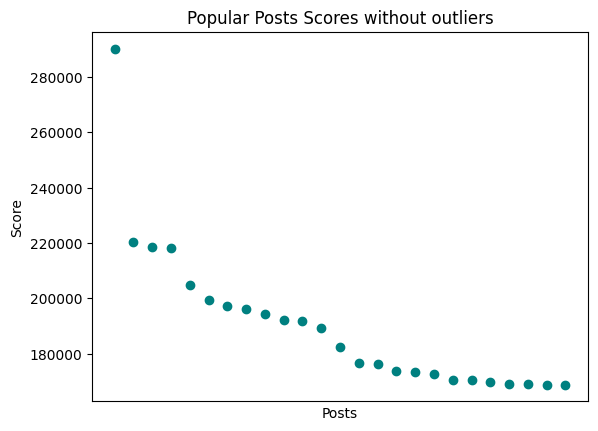
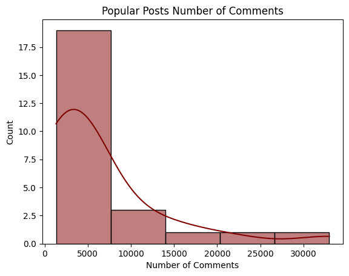
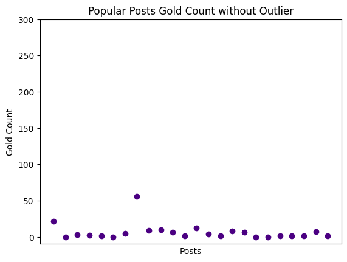
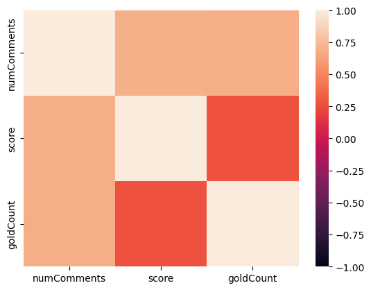
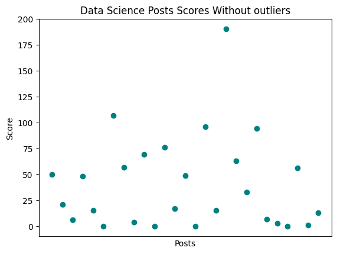
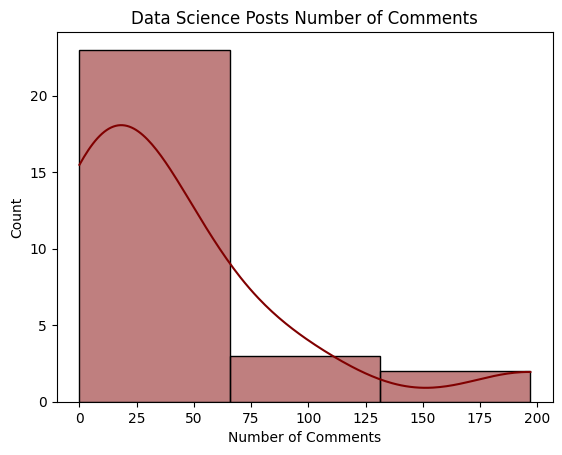
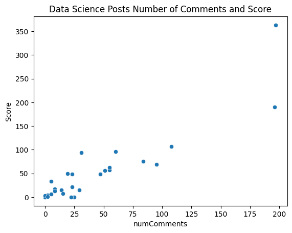
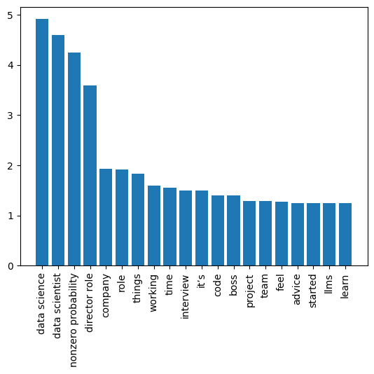
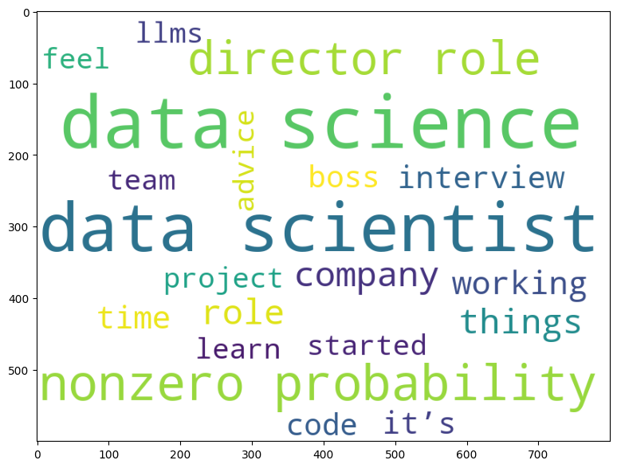
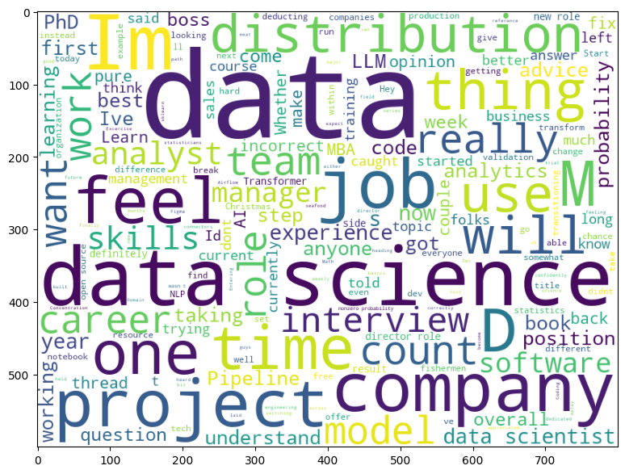

# REDDIT API PROJECT

A Python project for analyzing and visualizing popular posts and datascience subreddit posts from Reddit Api.

- API link: https://rapidapi.com/socialminer/api/reddit34

## Installation
Make sure you have Python installed. Clone the repository and install the required dependencies.

- git clone https://github.com/Ada-Lovelace-Akademi/youtube-api-project.git

- cd youtube-api-project

- pip install -r requirements.txt

## Usage
Run the run.py script to fetch Reddit data, perform analysis, and generate visualizations.
- python run.py

## Configuration
- Create a Rapid Api account.
- Subscribe to Reddit Api.
- In config folder create api_key.py file define the api key here

## Data
The project uses the requests library to interact with the Reddit API. It fetches data from the popular posts and data science subreddit posts and analyzes post score, number of comments and the text data.

## Results

### Popular Posts

- Most of the popular posts' score is between 160000 and 22000

- Mostly popular posts has about 5000 comments

- Popular posts mostly has gold between 0 and 50

- There is positive correlation between number of comments and score
- There is positive correlation between number of comments and goldCount

### Data Science Subreddit Posts
- Data Science posts' scores usally between 0 and 100

- Data Science posts usally have about 17 comments

-There is a positive correlation between number of comments and score

### Text Analyze
-Plotting most frequently used words 
- Data science, data scientist and non-zero probabilty is the most common words

- Showing frequently used words in the word cloud

- Showing word cloudgenerated from data science post 
texts  

## Contributing
Feel free to contribute by opening issues or submitting pull requests. 

## Contact
For questions or feedback, contact aslihanyoldas24@gmail.com

